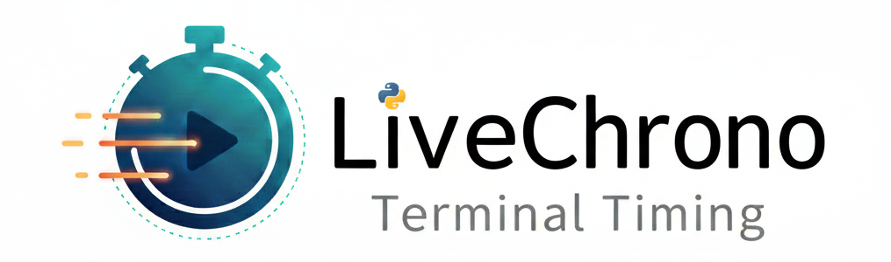

# LiveChrono

<p align="center">
  
</p>

LiveChrono is a tiny, dependency-free Python utility that prints a live, updating elapsed-time display to the terminal — with pause/resume support and millisecond precision.  
Perfect for CLI scripts, quick profiling, demo timers, and any situation where a human-friendly, live elapsed display is handy.

- Lightweight: single small module + a small `ChronoResult` model.
- Millisecond precision: built-in tokens for `%f` (milliseconds) and `%ms`.
- Pause / resume support with multiple cycles.
- Context-manager friendly: `with LiveChrono():`.

<p align="center">
  
</p>


---

## Why use LiveChrono?

- **Easy to integrate:** one small module, no heavy dependencies.
- **Human-friendly output:** HH:MM:SS.ms by default, and fully customizable format strings.
- **Interruptible:** pause and resume whenever you want.
- Great for demos, CLI tooling, profiling runs, and quick experiments.

---

## Features

- **Real-time elapsed display** (printed on one line).
- **Customizable format string** using simple tokens:
  - `%H` — hours (zero-padded, can exceed 23)
  - `%M` — minutes (00–59)
  - `%S` — seconds (00–59)
  - `%f` — milliseconds (000–999)
  - `%ms` — alternative token for milliseconds
- **Pause/resume** without losing elapsed time.
- Returns a `ChronoResult` object with `start_time`, `end_time`, `elapsed`, and `format_str`.
- Works **as a context manager** or as an **explicit object**.

---

## Installation

If you publish a wheel to PyPI, users can install it with:

```bash
pip install live-chrono
```

## Quickstart

Basic usage with the context manager:

```python
from live_chrono import LiveChrono
import time

# context manager style (recommended for quick blocks)
with LiveChrono():
    time.sleep(0.35)  # simulate work
```

Capturing result with context manager:

```python
from live_chrono import LiveChrono
import time

# context manager style (recommended for quick blocks)
with LiveChrono() as timer:
    time.sleep(0.35)  # simulate work

# timer.result is available after the context exits
res = timer.result
print(f"Elapsed seconds: {res.elapsed:.3f}")
# prints something like: Elapsed seconds: 0.350
```

Manual start/stop (with pause/resume):

```python
from live_chrono import LiveChrono
import time

t = LiveChrono(format_str="Elapsed: %H:%M:%S.%f", update_interval=0.05)
t.start()
time.sleep(0.2)

t.pause()  # stop counting, display indicates paused
time.sleep(0.2)  # this sleep does NOT count toward elapsed

t.resume()  # continue counting
time.sleep(0.15)

result = t.stop()  # stops background thread, returns ChronoResult
print("Final:", result.elapsed)  # float seconds (e.g. 0.35)
```

Example of using the `%ms` alias:

```python
# format using : separator and %ms alias for ms
with LiveChrono(format_str="%H:%M:%S:%ms"):
    time.sleep(0.123)

# printed line would look like:
# 00:00:00:123
```

## API Reference

### LiveChrono

`LiveChrono(update_interval=0.1, format_str="Elapsed: %H:%M:%S.%f")`  
Creates a live-updating timer.

**Parameters**  
- **update_interval** (*float*, default `0.1`) – Refresh rate in seconds. Lower values update the display more frequently.  
- **format_str** (*str*, default `"Elapsed: %H:%M:%S.%f"`) – Format string for rendering elapsed time (see format tokens above).

### Methods

- `start() → LiveChrono` – Begin timing and return the instance.  
- `stop() → ChronoResult` – Stop timing, join the background thread, and return a `ChronoResult`.  
- `pause()` – Pause the timer. No effect if already paused. Raises `RuntimeError` if called before `start()`.  
- `resume()` – Resume from a paused state. No effect if not paused.  
- `__enter__() / __exit__()` – Context-manager support.  

`ChronoResult` object

The `ChronoResult` model contains:

- `start_time`: wall-clock start time (UNIX epoch seconds)
- `end_time`: wall-clock end time (UNIX epoch seconds)
- `elapsed`: elapsed time in seconds (float)
- `format_str`: the format string used
- `timed_out` (if present in your model.py): optional boolean flag (default False)

## Notes & Best Practices

- The timer uses `time.perf_counter()` for high-resolution measurement of elapsed intervals, while `time.time()` is 
  used for wall-clock `start_time` and `end_time`.
- Although `time.perf_counter()` provides precise elapsed timing, minor variations can occur due to system scheduling, 
  thread management, or printing delays. Expect small differences (a few milliseconds) when measuring very short 
  durations.
- Output is printed to `stdout` on a single line that refreshes each update. For unit testing or silent operation, 
  redirect or capture `stdout` (e.g., with `contextlib.redirect_stdout`) or use an environment where console output is 
  acceptable.
- The `update_interval` controls display smoothness and how quickly the final value appears; it does **not** affect 
  timing accuracy, which is based solely on `perf_counter`.
- Multiple pause/resume cycles are supported, with elapsed time accumulating only while the timer is running.

## License

This project is licensed under the MIT License.

You are free to use, copy, modify, merge, publish, distribute, sublicense,
and/or sell copies of the software, provided that the copyright notice
and permission notice appear in all copies.

See the [LICENSE](LICENSE) file for the full text.
